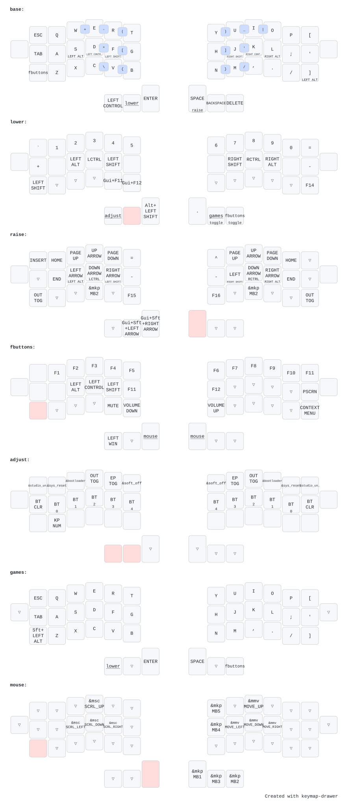

# ZMK Firmware для Jorne-совместимой клавиатуры

**Статус**: ✅ **РАБОЧАЯ КОНФИГУРАЦИЯ**

Полностью функциональная конфигурация ZMK для беспроводной клавиатуры Jorne-WL v3.0.1 на nice!nano v2.

## Быстрый старт

### Требования
- Клавиатура Jorne-WL v3.0.1 с контроллерами nice!nano v2
- GitHub репозиторий с GitHub Actions (для автоматической сборки)
- Или локальное окружение ZMK (west, Zephyr 3.x)

### Шаг 1: Сборка прошивки

**Вариант A: GitHub Actions (рекомендуется)**
1. Форк этого репозитория
2. Пуш в GitHub
3. Перейти на вкладку Actions → ждём сборки
4. Скачать артефакты `firmware.zip`

**Вариант B: Локальная сборка**
```bash
west build -b nice_nano_v2 -d build/jorne_left -- -DSHIELD=jorne_left
west build -b nice_nano_v2 -d build/jorne_right -- -DSHIELD=jorne_right
```

### Шаг 2: Прошивка контроллеров

Для каждой половины клавиатуры:

1. **Подключить USB-C** контроллер к компьютеру
2. **Активировать UF2 bootloader**:
   - Двойной клик кнопку RESET (если есть), или
   - Замкнуть контакты RST и GND на 1 сек
3. **Контроллер появится как USB диск** (NICENANO или аналогичный)
4. **Скопировать `.uf2` файл** на диск:
   - Левая половина: `jorne_left-nice_nano_v2-zmk.uf2`
   - Правая половина: `jorne_right-nice_nano_v2-zmk.uf2`
5. **Диск автоматически отключится** (прошивка завершена)

### Шаг 3: Bluetooth паринг

1. **Включить батарею** на обеих половинах
2. **Система автоматически распознает** устройство "Corne" в Bluetooth
3. **Нажать "Подключить"** в диалоге паринга
4. ✅ Клавиатура готова к использованию

### Проблемы при подключении?

**Если клавиатура не видна в Bluetooth:**

1. **Убедиться, что обе половины прошиты нормальной прошивкой**
   - (не `settings_reset` — в ней Bluetooth отключен)

2. **Сбросить Bluetooth состояние:**
   - Прошить `settings_reset-nice_nano_v2-zmk.uf2` на обе половины
   - Дождаться перезагрузки
   - Прошить нормальную прошивку (`jorne_left` и `jorne_right`)
   - Переподключиться

3. **Удалить старые Bluetooth девайсы (macOS):**
   - System Settings → Bluetooth → Забыть старые "Corne"
   - Переподключиться

4. **Проверить наличие батареи и питание**

## Конфигурация

### Основные параметры
- **ZMK версия**: v0.2.1 (стабильный релиз, перед Zephyr 4.1)
- **Board**: `nice_nano_v2`
- **Shields**: `jorne_left`, `jorne_right`
- **Слои**: 3 (base, symbols/BT, numbers/navigation)

### Раскладка


## Структура репозитория

```
.
├── config/
│   ├── jorne.conf          # ZMK конфигурация (BT, sleep и т.д.)
│   ├── jorne.keymap        # Раскладка (3 слоя)
│   └── west.yml            # Версия ZMK (v0.2.1)
├── build.yaml              # GitHub Actions матрица сборки
├── .github/workflows/
│   └── build.yml           # Конфиг для CI/CD
├── docs/
│   ├── deep-research.md    # Анализ аппаратной части
│   ├── configuration-summary.md  # Финальная конфигурация
│   └── README.md           # Этот файл
└── firmware/               # Бинарные прошивки (результаты сборки)
```

## Файлы конфигурации

### `config/jorne.conf`
Минимальная конфигурация для стабильного BT:
```ini
CONFIG_BT_CTLR_TX_PWR_PLUS_8=y  # Увеличить мощность Bluetooth
# CONFIG_ZMK_RGB_UNDERGLOW=y     # RGB (если есть)
# CONFIG_ZMK_DISPLAY=y           # OLED дисплей (если есть)
```

**Почему минимальная?**
- Экспериментальные BLE опции отключены (стабильность)
- Sleep отключён (не нужен для большинства)

### `config/jorne.keymap`
Раскладка для Jorne (44 позиции):
- Row 1 начинается с `&none` (фантомная клавиша, физически отсутствует)
- Custom behaviors для удобного использования модификаторов

### `config/west.yml`
```yaml
revision: v0.2.1  # ZMK версия (важно для совместимости)
```

**Почему v0.2.1, а не main?**
- main ZMK включает Zephyr 4.1 с изменениями в board definitions
- v0.2.1 — последний стабильный релиз, где `nice_nano_v2` работает корректно
- Гарантирует совместимость с прошивкой продавца

## Редактирование раскладки

- **keymap-editor**: https://nickcoutsos.github.io/keymap-editor/

- **keymap-drawer**: https://keymap-drawer.streamlit.app


## Ссылки и ресурсы

- **ZMK Документация**: https://zmk.dev
- **Официальный Jorne конфиг**: https://github.com/joric/jorne-zmk-config
- **ZMK GitHub**: https://github.com/zmkfirmware/zmk
- **Bluetooth паринг troubleshooting**: https://zmk.dev/docs/troubleshooting/connection-issues


